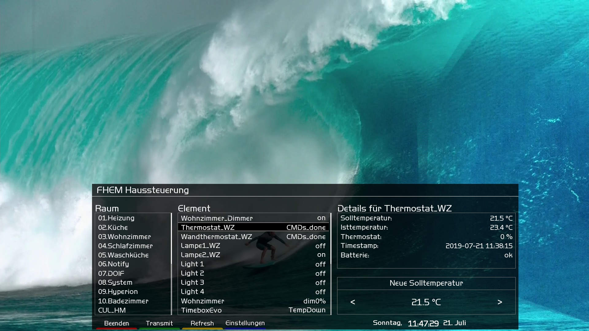

## e2Fhem
small enigma2 fhemfrontend



Thx Waldmensch for initial setup

## Supportet devices

- AptToDate
- CUL
- CUL_HM
- CUL_TX
- CUL_WS
- DOIF
- dummy
- ESPEasy
- FBDECT
- FHT
- FRITZBOX
- FS20
- GHoma
- HMCCUDEV
- HUEDevice
- Hyperion
- IT
- LightScene
- MAX
- MQTT_DEVICE
- MQTT2_DEVICE
- notify
- pilight_switch
- pilight_temp
- PRESENCE
- readingsProxy
- SYSMON
- Weather
- WOL


## Installation

Enigma2
- push all files to : /usr/lib/enigma2/python/Plugins/Extensions/fhem/

Server
- JsonList2 only is now working.
- See section --> "Device Specific Info"


## How To

- First setup details in settings.
- If connection is ok, supportet devices show up.
- If not, go to settings and activate logfile. Check for http-statuscode.
- No, static and dynamic csrfToken are fine. 
- But static and dynamic csrfToken is semi-automatic. Hit getToken in settings.
- Http and Https are supported. Https is slower (I have to investigate).
- Different devices have different functions.
- Some have full support and some have only readings. So the basics are:

1. Navigate with KeyUp, KeyDown, KeyLeft and KeyRight
2. KeyOk for on,off and specials.
3. ChannelUp and ChannelDown for dimming and temperature.
4. Num1 till Num4 for moreChannelSwitches.


## Device Specific Info

__DOIF / cmdState__<br/>
No spaces, fill the gap for example with "_".
Or use compound words.
```
"LightNightMode|OnlyDeskLightOn|MorningLightDown|MorningLightUp"
"Coffee_cooks|Coffee_off|Coffee_finished"
"Temp_unter_48°C|Temp_ok"
"WarmWaterOk|WaterCold"
```

__Dummy fourswitch example__
```
defmod iconDemo dummy
attr iconDemo devStateIcon 1.on:on:on:on1+off 1.off:off:on:on1+on 2.on:on:on:on2+off 3.off:off:on:on3+on 4.on:on:on:on4+off 4.off:off:on4+on
attr iconDemo readingList on1 on2 on3 on4
attr iconDemo room 03.Wohnzimmer
attr iconDemo setList on1:on,off on2:on,off on3:on,off on4:on,off
attr iconDemo stateFormat 1:on1 2:on2 3:on3 4:on4
attr iconDemo webCmd on1:on2:on3:on4

setstate iconDemo 1:on 2:off 3:on 4:off
setstate iconDemo 2019-02-25 00:25:21 on1 on
setstate iconDemo 2019-02-24 14:43:07 on2 off
setstate iconDemo 2019-02-24 16:01:57 on3 on
setstate iconDemo 2019-02-24 16:02:05 on4 off
setstate iconDemo 2019-02-23 23:14:56 state on
```

__FBDECT__<br/>
To set the temperature for thermostat, please set subType in Fhem.
```
attr yourThermostat subType thermostat
```

__HMCCUDEV__<br/>
At the moment only HM-CC-RT-DN supported.<br/>
Ch +/- for temp.<br/>
In Fhem you have to add one attribut.<br/>

```
attr yourThermostat subType thermostat
```

__HUEGroup__<br/>
Please set for best compatibility with HUEGroup the following in fhem for each group.
```
attr yourHUEGroup createActionReadings 1
attr yourHUEGroup createGroupReadings 1
```

__stateFormat__<br/>
In the past doublequotes (") inside HTML-Tags break matching device. But normally it is not nessesary anymore.<br/>
If you notice, something is wrong, use singlequotes (').
```
my $state = ReadingsVal($name, "state", "off");   
  return "".sprintf("&nbsp;&nbsp;Spannung: %.0f V &nbsp;&nbsp;Stromstärke: %.3f A &nbsp;&nbsp;Leistung: %.0f W &nbsp;&nbsp;Wifi_RSSI: %.0f %%", ReadingsVal($name,"ENERGY_Voltage",0), ReadingsVal($name,"ENERGY_Current",0), ReadingsVal($name,"ENERGY_Power",0), ReadingsVal($name,"Wifi_RSSI",0)).'</div>' if($state eq "on");   
  return "".sprintf("&nbsp;&nbsp;Spannung: %.0f V &nbsp;&nbsp;Stromstärke: %.3f A &nbsp;&nbsp;Leistung: %.0f W &nbsp;&nbsp;Wifi_RSSI: %.0f %%", ReadingsVal($name,"ENERGY_Voltage",0), ReadingsVal($name,"ENERGY_Current",0), ReadingsVal($name,"ENERGY_Power",0), ReadingsVal($name,"Wifi_RSSI",0)).'</div>' if($state eq "off");     
  return "".sprintf("&nbsp;&nbsp;Spannung: %.0f V &nbsp;&nbsp;Stromstärke: %.3f A &nbsp;&nbsp;Leistung: %.0f W &nbsp;&nbsp;Wifi_RSSI: %.0f %%", ReadingsVal($name,"ENERGY_Voltage",0), ReadingsVal($name,"ENERGY_Current",0), ReadingsVal($name,"ENERGY_Power",0), ReadingsVal($name,"Wifi_RSSI",0)).'</div>' if($state eq "reboot"); 
  return "".sprintf("&nbsp;&nbsp;Spannung: %.0f V &nbsp;&nbsp;Stromstärke: %.3f A &nbsp;&nbsp;Leistung: %.0f W &nbsp;&nbsp;Wifi_RSSI: %.0f %%", ReadingsVal($name,"ENERGY_Voltage",0), ReadingsVal($name,"ENERGY_Current",0), ReadingsVal($name,"ENERGY_Power",0), ReadingsVal($name,"Wifi_RSSI",0)).'</div>' if($state eq "offline");   
}
```

## TODO

- <del>autoswitch- or manualswitch for http/https</del>
- <del>add static csrfToken</del>
- <del>final solution to remove HTML-Tags when stateFormat is pimped for style</del>
- <del>add dynamic csrfToken</del>
- <del>full switch to jsonlist2+</del>
- add more devices
- ...
